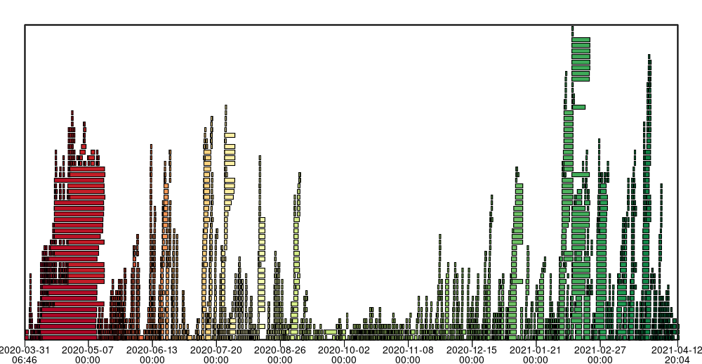
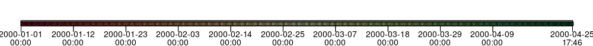
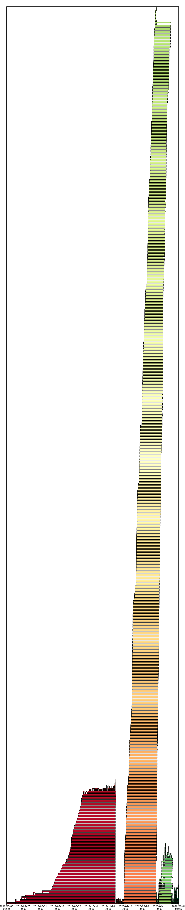

# Postgres BRIN index visualization

This repo contains code for visualizing what your timestamp BRIN index looks
like. It generates plots that look like this:



## Why visualize BRIN indexes?

BRIN indexes have pitfalls. They are best suited for timestamp columns that
are monotonically non-decreasing on append-only tables. Deleting columns or
adding rows out of order or concurrently can result in pathological indexes
that cause a lot of extraneous data reading. See:
<https://blog.crunchydata.com/blog/avoiding-the-pitfalls-of-brin-indexes-in-postgres>

### Ideal BRIN index

An ideal BRIN index has no overlapping block ranges: each timestamp value
maps to exactly 1 block range. When querying for a time span, the extra data
read is at most up to 2 block ranges (up to 2MB, with the default
blocks_per_range of 128 and block size of 8kb). An ideal BRIN example:



### Problematic BRIN index

Overlapping isn't necessarily bad, as long as each block range still covers a
small time window. The real problem is when your block ranges are (1) heavily
overlapping and (2) cover large time spans. The following is an example from a
real database:



Here, there's a large stack of block ranges from ~2020-01 to 2020-03. Queries
for a single day's data in this date range will match many block ranges,
resulting in a lot of unnecessary data being read. This will show up in
`EXPLAIN ANALYZE` as a high `Rows Removed by Index Recheck` value ([example
EXPLAIN on a bad BRIN](https://explain.depesz.com/s/7fFk)).

## How to use these tools

### Export BRIN internals with export_brin_items.sh

```shell
PGDB=your-db-hostname
PGUSER=your-db-user
PGPASSWORD=your-db-user-password
PGIDX=your-brin-index-name
./export_brin_items.sh
```

`export_brin_items.sh` uses the `pageinspect` extension to output a CSV
containing the BRIN index's internals.

Note: it's expected that the script will output an error like: `ERROR: block
number N is out of range for relation "TABLE_idx"`. The script simply keeps
querying until it hits this error.

### Compute and plot overlaps with bro_viz.py

```shell
./bro_viz.py -i brinexport_20210412_174650.csv
```

`bro_viz.py` reads the exported CSV from the previous step and generates an
SVG plot showing the block ranges in the index.

For large tables with many block ranges, it can take a while to compute the
overlap. `bro_viz.py` will save the intermediate `BrinOverlap` data as JSON.
You can use this JSON as the input for `bro_viz.py` if you'd like to tweak
the rendering options (e.g., width or colormap) without recomputing the
overlap again.

### Other tools

- `bro_relevant_blocks.py`: Specify a date (`-d`) or date range (`-d` and
  `-d2`) and see what block ranges match.
- `bro_timespan_hist.py`: Render a histogram of block range time spans.

## Reference

- good description of BRIN pitfalls:
  <https://blog.crunchydata.com/blog/avoiding-the-pitfalls-of-brin-indexes-in-postgres>
- Postgres BRIN docs: <https://www.postgresql.org/docs/current/brin-intro.html>
- pageinspect extension for exporting BRIN internals:
  <https://www.postgresql.org/docs/13/pageinspect.html#id-1.11.7.31.7>
